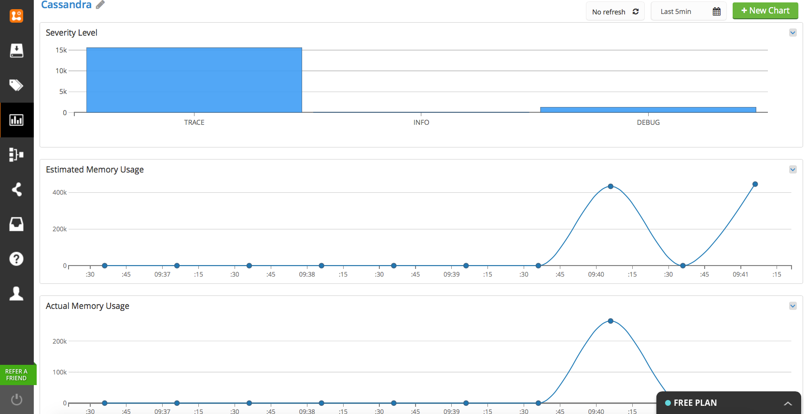

Cassandra v2.0.14 Database Monitoring Community Pack
-----------------------------------------------------

This Pack contains the following:

* **Saved Queries:** The user is able to use saved searches and take an advantage of Cassandra's Log4j enabled logging capabilities. The user can look closer into the severity levels of Cassandra's log messages and take actions in case of fatal events. 

* **Tags and Alerts:** The user is alerted of fatal and warning messages if one appear in the log collection. The user is also able to easily spot the normal behaviour of of the database such as "new table creation" or "new keyspace creation". 

* **Dashboards:** There are few out-of-the-box graphs pre-installed in the pack. The user is able to track the actual and estimated memory usage or compare the two using multiline chart included in the pack. 

